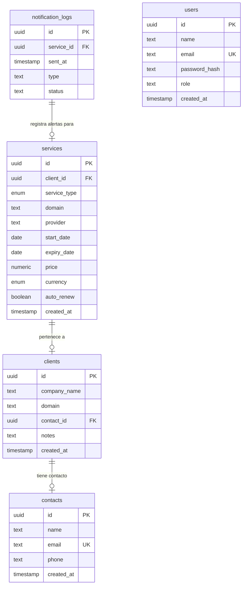

# Product Requirements Document (PRD) — Renovio

---

## 1. Introducción y Resumen Ejecutivo

**Renovio** es una aplicación SaaS interna y herramienta administrativa diseñada para centralizar, controlar y automatizar el seguimiento de fechas de vencimiento de servicios web de clientes (hosting, dominios, mantenimiento, certificados SSL, cuentas de correo electrónico, etc.). 

El objetivo principal es resolver la pérdida de renovaciones críticas, evitar cortes de servicios a clientes finales y automatizar las comunicaciones preventivas mediante alertas estructuradas antes de los vencimientos.

---

## 2. Objetivos del Producto

*   **Legibilidad Extrema (Aesthetic Editorial):** Adoptar un enfoque visual sobrio inspirado en publicaciones académicas y científicas (como *Distill.pub* y los principios de *Edward Tufte*), eliminando el exceso de widgets pesados de los paneles SaaS comunes.
*   **Monitoreo Proactivo:** Proveer un resumen narrativo de la cartera de servicios en tiempo real y listas priorizadas basadas en días restantes.
*   **Automatización de Notificaciones:** Enviar correos electrónicos automáticos estilo texto plano a los administradores y clientes en ventanas de tiempo predefinidas (30, 15, 7 días y día de vencimiento).
*   **Minimalismo Funcional:** Limitar la complejidad del diseño a interacciones puramente de texto, tablas alineadas geométricamente y formularios directos tipo "hoja en blanco".

---

## 3. Personas y Audiencia Objetivo

### Administrador / Webmaster (Mauro)
*   **Rol:** Gestiona los clientes, registra servicios nuevos y actualiza el estado de las renovaciones.
*   **Necesidad:** Una vista rápida y escaneable que le indique qué servicios vencen pronto, cuánto dinero se proyecta recaudar en el mes actual y alertas críticas que requieran intervención inmediata.

### Cliente Final
*   **Rol:** Dueño del sitio web o servicio.
*   **Necesidad:** Recibir recordatorios de pago sencillos, claros, en texto plano y oportunos en su correo, evitando que el correo parezca spam o publicidad.

---

## 4. Requisitos Funcionales y Características Clave

### 4.1. Panel General (Dashboard Narrativo)
*   **Reporte Dinámico en Prosa:** Párrafo editorial generado con variables dinámicas del estado del negocio (ej. *"La cartera comprende X clientes y Y servicios. Z servicio(s) requiere(n) atención inmediata"*).
*   **Resumen de Métricas (Summary Strip):** Cinta de indicadores sin cajas ni marcos, separada por líneas finas verticales, para visualizar:
    *   Servicios Totales
    *   Servicios Críticos (Vencidos o con <7 días)
    *   Próximos a vencer (30 días)
    *   Vigentes
    *   Total de Clientes
*   **Proyección Financiera:** Cálculo en tiempo real de ingresos estimados en pesos colombianos (COP), con consumo automático de API para conversión de tarifas registradas en dólares (USD).
*   **Volumen por Tipo de Servicio:** Minigráficos integrados (sparklines) horizontales que indican la distribución de servicios (Sitio Web, Dominio, Hosting, SSL, etc.).
*   **Tablas de Datos:** 
    *   *Sección Crítica:* Tabla con servicios que requieren atención ordenados por días de vencimiento.
    *   *Sección Completa:* Tabla indexada con todos los servicios activos del sistema, incluyendo opciones directas para editar y eliminar.

### 4.2. Directorio de Clientes
*   Búsqueda instantánea de clientes por nombre de empresa o dominio en el cliente web.
*   Formulario de registro simplificado en un solo paso:
    *   Asociación a un contacto existente o creación de uno nuevo en el mismo formulario.
*   Hoja de vida del cliente (`/clients/[id]`):
    *   Detalle del contacto (nombre, correo, teléfono).
    *   Notas internas asociadas.
    *   Tabla de servicios contratados por ese cliente en específico.

### 4.3. Gestión de Servicios
*   Formulario de registro de servicio (`/services/new`):
    *   Campos: Cliente, tipo de servicio, proveedor, fecha de inicio, período (1, 6, 12 meses), fecha de vencimiento calculada, precio, moneda (COP/USD) y switch de renovación automática.

### 4.4. Historial de Notificaciones (`/logs`)
*   Registro cronológico de los envíos de alerta emitidos por el sistema.
*   Filtros dinámicos de visualización (Todos, 30 días, 15 días, 7 días, Vencidos) para auditar qué correos han sido enviados y cuáles fallaron.

### 4.5. Automatización de Alertas (Cron Background Worker)
*   Tarea programada diaria que:
    1.  Consulta la base de datos Neon.
    2.  Identifica los servicios que cumplen exactamente 30, 15, 7 días antes de expirar, o aquellos que expiran hoy.
    3.  Llama al servicio de mensajería (Resend) para enviar un correo de aviso en texto plano.
    4.  Registra el resultado en la tabla de `notification_logs`.

---

## 5. Requisitos No Funcionales y Guía Estética (UI/UX)

### 5.1. Estética y Diseño (Fiel a .interface-design/system.md)
*   **Tipografía Editorial:** Uso de fuente Serif (`Lora`) para textos de lectura y encabezados narrativos; fuente Sans-serif (`Inter`) para datos, formularios y navegación.
*   **Números Tabulares:** Uso de `font-variant-numeric: tabular-nums` para que todas las cifras numéricas, precios y fechas se alineen verticalmente de manera perfecta en las columnas.
*   **Estrategia de Profundidad Plana:** Cero sombras pesadas o bordes gruesos. La separación estructural se realiza mediante bordes finos de baja opacidad (`rgba(0, 0, 0, 0.09)` o `rgba(255, 255, 255, 0.08)`).
*   **Controles Adaptados:** Los campos `<select>` del formulario deben usar chevrons personalizados SVG en lugar de controles nativos del sistema operativo, respetando el color de texto del tema correspondiente.
*   **Modo Oscuro Soportado:** Transición suave a través de atributos `data-theme="dark"` aplicando variables CSS adaptadas en contrastes y hovers (`--bg-hover`).

### 5.2. Rendimiento y Despliegue
*   **Server-Side Rendering (SSR):** Habilitado en Astro para garantizar carga dinámica de datos e integración segura de secretos.
*   **Despliegue Continuo (CI/CD):** Alojado en Coolify utilizando `Dockerfile` optimizado para `pnpm` con caché de capas y congelamiento de versiones de dependencias (`pnpm install --frozen-lockfile`).

---

## 6. Modelo de Datos y Esquema de BD

El esquema relacional está definido en PostgreSQL mediante **Drizzle ORM**:

---

## 7. Arquitectura Tecnológica

*   **Framework Principal:** Astro (modo de salida `server`).
*   **Adaptador de Despliegue:** `@astrojs/node` para Coolify (producción) y soporte local con Drizzle Kit.
*   **ORM:** Drizzle ORM + Drizzle Kit para migraciones automáticas (`db:push`).
*   **Base de Datos:** Neon Database Serverless (PostgreSQL sobre HTTP).
*   **Proveedor de Correo:** Resend (integrado en el endpoint `/api/notify`).
*   **Control de Sesiones:** Autenticación por sesión ligera basada en cookies firmadas y cifrado simple de contraseñas (SHA-256 local / Bcrypt).

---

## 8. Plan de Trabajo y Siguientes Pasos

1.  **Estabilización de Migraciones:** Asegurar que los endpoints sincronicen adecuadamente los esquemas de bases de datos remotas en producción.
2.  **Robustez de Notificaciones:** Implementar reintentos automáticos de envío de correos si la API de Resend falla.
3.  **Configuración de Tarea Programada (Cron):** Integrar la automatización diaria del Worker a nivel del servidor de despliegue.
